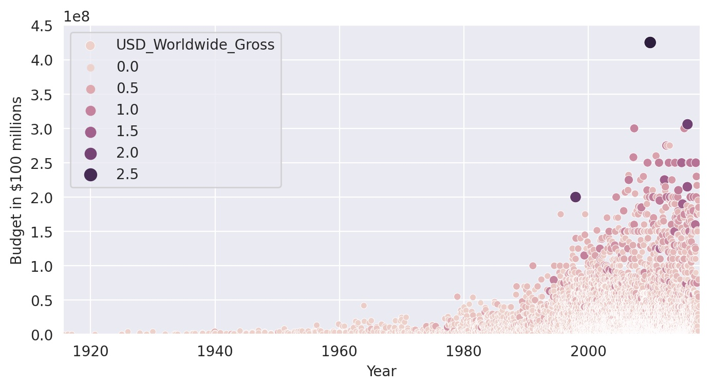
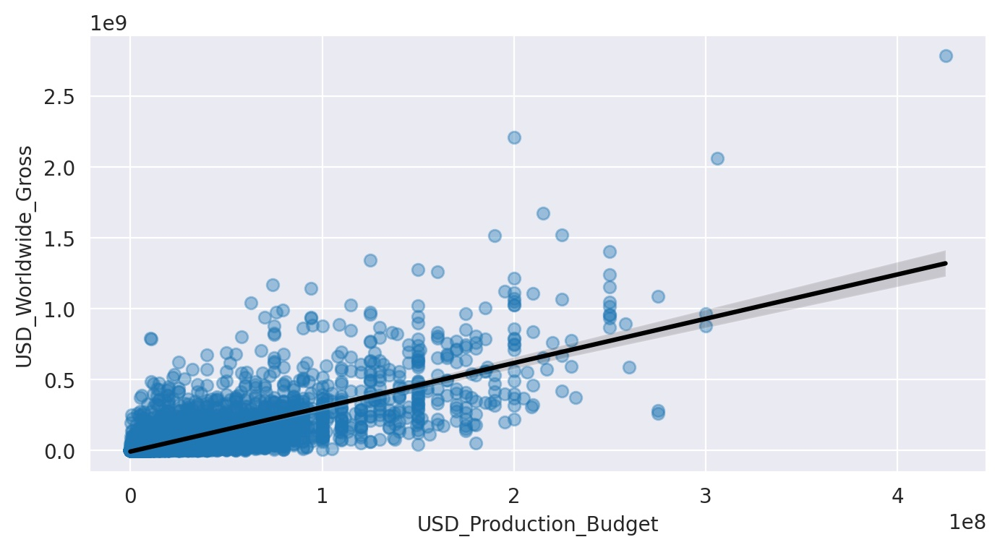
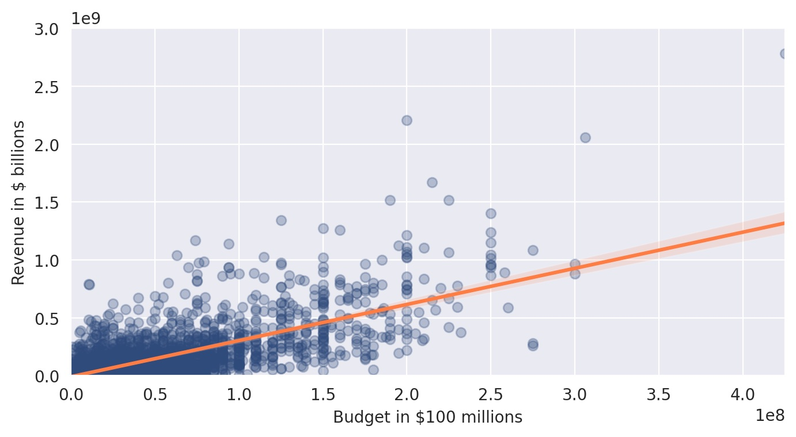

# Seaborn, built on the power of MatPlotLib, brings added charting capability to Python. 
- 👋 Hi, I’m @WilliamSpanfelner
- 👀 I’m interested in using Python with Swift in iOS environments and why it may or may not be desirable.
- 🌱 I’m currently learning Python with the London App Brewery and Angela Yu's [100 Days of Code: 
The Complete Python Pro Bootcamp for 2022](https://www.udemy.com/course/100-days-of-code/) on Udemy.  
- 🧑‍💻  Everyone love the movies, but have you ever thought about their budgets and revenue?  Clean-up the dataset and analyse the movie data to reveal some interesting statistics.  Convert formatted column data to integer data using the Pandas 'replace' function.  Use the Pandas query function to look at the data in different ways.  Get descriptive statistics of a dataframe using the Pandas describe function. Charting the data with Seaborn puts real power in the hands of the developer.
- 💞️ I’m looking to collaborate on application development.
- 📫 How to reach me...

[//]: # ([![email]&#40;https://img.shields.io/badge/email-wil--1--am%40outlook.com-grey?style=plastic&#41;]&#40;mailto:wil-1-am@outlook.com&#41;)

